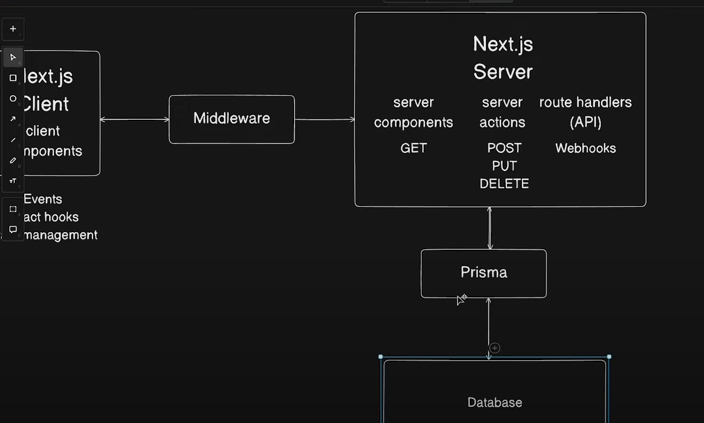

# Next.js First Project

Este es un proyecto básico de Next.js que sirve como introducción a los conceptos y funcionalidades de Next.js.

## Descripción

Este proyecto incluye tanto componentes del cliente como del servidor de Next.js. Aquí puedes ver cómo se manejan diferentes acciones en el servidor y cómo se comunican con los componentes del cliente.

## Características

- **Next.js Client**: Componentes del cliente que manejan la interfaz de usuario.
- **Next.js Server**: Componentes del servidor que manejan las acciones del servidor y los controladores de rutas.



## Requisitos

- Node.js
- npm o yarn

## Instalación

1. Clona el repositorio:
   ```bash
   git clone https://github.com/alejanfh/nextjs-first-project.git
   ```
2. Instala las dependencias:
   ```bash
   cd nextjs-first-project
   npm install
   ```
   o si usas yarn:
   ```bash
   yarn install
   ```

## Uso

Para iniciar el servidor de desarrollo:

```bash
npm run dev
```

## Si tienes carpeta y no github

### Actualiza la URL del repositorio remoto

git remote set-url origin https://github.com/alejanfh/nextjs-first-project.git

### O elimina y añade el remoto nuevamente

git remote remove origin
git remote add origin https://github.com/alejanfh/nextjs-first-project.git

### Verifica la URL del remoto (opcional)

git remote -v

### Renombra la rama principal a "main" (si aún no lo has hecho)

git branch -M main

### Empuja los cambios al repositorio remoto

git push -u origin main
